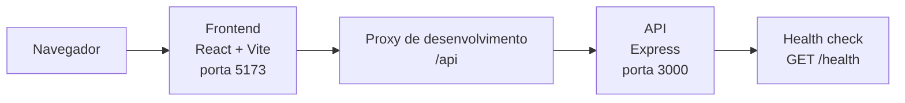

# Arquitetura

Este documento é a referência de arquitetura para quem contribui com o RPG
Combat Manager. Ele separa o estado já implementado da direção definida para a
evolução do projeto.

## Visão geral

O sistema é uma aplicação full-stack formada por um frontend React e uma API
Express. Durante o desenvolvimento, os dois serviços são executados pelo Docker
Compose.

O navegador acessa o frontend em `http://localhost:5173`. Requisições para
`/api` são encaminhadas pelo proxy do Vite para o serviço `server` na rede do
Docker Compose, removendo o prefixo `/api`. Por isso,
`/api/health` no frontend chega a `GET /health` na API.

O Compose expõe a API diretamente em `127.0.0.1:3000`, mantém os
`node_modules` de cada serviço em volumes separados e só inicia o frontend
depois que o health check da API estiver saudável.

## Estado atual

### Frontend

O frontend usa React e Vite. A aplicação atualmente apresenta uma tela de
boas-vindas e permite avançar para um estado de modo offline. Ainda não há
integração de dados de domínio com a API.

### API

A API usa Express. Ela disponibiliza `GET /health`, que responde
`{ "status": "ok" }`, e responde `404` com `{ "error": "Not found" }` para
rotas não encontradas. Não há, por enquanto, persistência, autenticação ou
regras de negócio de combate implementadas.

## Arquitetura de evolução

### Frontend: componentes e páginas

O frontend seguirá uma arquitetura orientada a componentes:

- **Páginas** compõem a interface de cada tela, administram estado e concentram
  regras e comportamentos específicos daquela tela.
- **Componentes reutilizáveis** são pequenos, coesos e estritamente de
  apresentação; recebem dados e callbacks por propriedades.
- Regras particulares de uma página não devem ser acopladas a componentes
  reutilizáveis.

Ao adicionar uma funcionalidade, a página deve ser o ponto de integração entre
estado, comportamentos da tela e componentes visuais.

### Estilização e identidade visual

O Tailwind CSS deve constituir a abordagem preferencial para a implementação
de estilos no frontend, em razão de sua capacidade de promover consistência e
composição eficiente da interface. Essa preferência não é absoluta: outra
solução de estilização pode ser adotada quando se mostrar tecnicamente mais
adequada ao contexto da funcionalidade.

As interfaces devem priorizar uma identidade visual associada à fantasia, em
consonância com a natureza de um sistema de gerenciamento de combates de RPG
por turnos. Essa diretriz deve orientar escolhas de composição, elementos
visuais e linguagem de interface, sem comprometer legibilidade, acessibilidade
ou usabilidade.

### API: MVC

A API evoluirá com as seguintes camadas:

| Camada | Responsabilidade |
| --- | --- |
| `routes` | Definir endpoints e encaminhar requisições aos controllers. |
| `controllers` | Tratar requisições e respostas HTTP. |
| `services` | Implementar regras de negócio. |
| `repositories` | Acessar e persistir dados. |
| `models` | Definir entidades e estruturas do domínio. |

O fluxo esperado é: a rota encaminha a requisição ao controller, o controller
delega a regra de negócio a um service, e o service usa repositories e models
quando necessário. Cada camada deve manter sua responsabilidade, sem pular
diretamente para preocupações de outra camada.

## Convenções para contribuições

- Identificadores de código, incluindo variáveis, funções, classes, tipos,
  arquivos e símbolos equivalentes, devem ser escritos em inglês.
- A interface de usuário e a documentação do projeto devem ser redigidas em
  português formal.
- Preserve o frontend e a API como aplicações independentes, conectadas pelo
  prefixo `/api` durante o desenvolvimento.
- Coloque lógica de tela nas páginas e mantenha componentes reutilizáveis sem
  dependência de regras de negócio específicas.
- Ao criar funcionalidades da API, respeite as fronteiras entre routes,
  controllers, services, repositories e models.
- Atualize este documento quando uma decisão arquitetural mudar ou quando uma
  nova área passar a exigir documentação própria.

## Operação local

O ambiente é iniciado com Docker Compose e usa hot reload por bind mounts. Os
comandos de inicialização, logs, reinicialização e encerramento estão no
[README](../README.md). Consulte-o para os detalhes operacionais completos.

## Próximos documentos

Este é o documento único de arquitetura enquanto o projeto permanece pequeno.
Quando o frontend ou a API acumularem decisões próprias relevantes, podem ser
adicionados documentos específicos, como `frontend-architecture.md` ou
`backend-architecture.md`, sem duplicar a visão geral mantida aqui.
